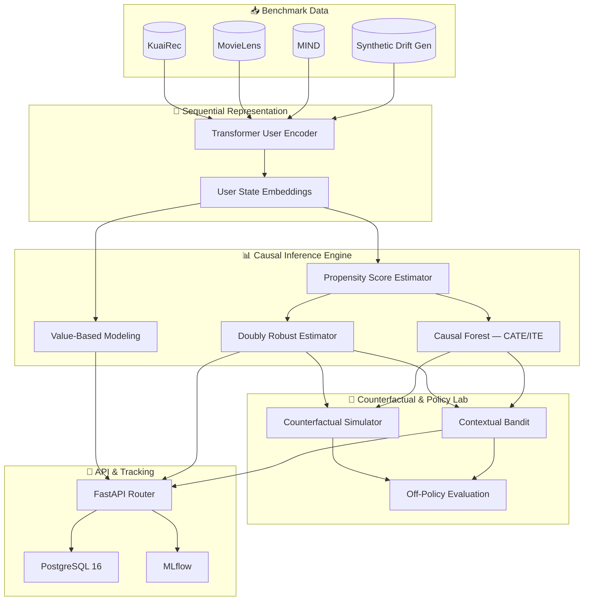

# 🎯 Causal Personalization for OTT Platforms
### Modeling *why* users stay, not just *that* they stayed

[](https://www.python.org/)
[](https://pytorch.org/)
[](https://econml.azurewebsites.net/)
[](https://fastapi.tiangolo.com/)
[](https://www.postgresql.org/)
[](https://mlflow.org/)

---

## ⚡ TL;DR

Most recommendation systems optimize for clicks and watch-time — signals that are *correlated* with retention, not *causal* to it. This project asks a harder question: **if we change what we show a user, or when we notify them, what actually happens to their long-term satisfaction — versus what would have happened anyway?**

To answer that, I built the full causal ML stack from scratch: value decomposition → propensity-adjusted treatment effect estimation → counterfactual policy simulation → drift monitoring, wrapped in a typed, containerized FastAPI service with MLflow experiment tracking. Evaluated on public OTT/media benchmarks — **KuaiRec, MovieLens, MIND**.

**In one line:** given a user and a candidate intervention, this system estimates *who it actually helps* — before you'd ever risk showing it to a real one.

---

## 🧠 The Problem, Concretely

Say a platform tests a new "continue watching" nudge notification. Engagement goes up. Great — except:

- Maybe it only worked on users who were *already* about to re-engage (no causal effect, pure correlation).
- Maybe it worked on one segment and *annoyed* another into churning — but the aggregate metric hid that.
- Maybe it worked today, and will stop working in three months as behavior drifts.

Standard predictive ML can't distinguish any of these cases. This project is my answer to that gap — built with the actual causal inference toolkit (not just A/B test averages) that's needed to get it right.

---

## 🔬 What's Inside

| Capability | What It Actually Does |
| :--- | :--- |
| 🎯 **User Value Modeling** | Breaks "engagement" apart into engagement, satisfaction, and churn-risk components — so "value" isn't one flattened number. |
| 📊 **Causal Effect Estimation** | Uses IPW, Doubly Robust estimation, and EconML Causal Forests to estimate *heterogeneous* treatment effects — i.e., which user segments an intervention actually helps, not just the average effect. |
| 🧬 **Sequential User Representation** | A PyTorch Transformer encodes each user's interaction history into a dense state vector, so causal estimates have real behavioral context instead of static features. |
| 🔮 **Counterfactual Policy Evaluation** | Simulates "what if we'd shown this instead" via Off-Policy Evaluation and Contextual Bandits — scoring new policies against logged data *before* risking them on live users. |
| 📉 **Behavioral Drift Monitoring** | Watches for both population drift (user behavior changing) and causal drift (treatment effects changing) — because a causal model trained in January can quietly go stale by June. |

---

## 🏗️ Architecture



---

## 🛠️ Tech Stack

- **Core:** Python 3.11
- **ML / Deep Learning:** PyTorch 2.4 · Scikit-learn 1.5 · NumPy · SciPy
- **Causal Inference:** EconML 0.15 · Statsmodels · SHAP
- **API / Backend:** FastAPI 0.115 · Uvicorn · WebSockets
- **Data / Storage:** PostgreSQL 16 · SQLAlchemy 2.0 · Alembic · PyArrow (Parquet)
- **Experiment Tracking:** MLflow
- **Ops:** Docker · Docker Compose

---

## 📂 Repository Structure

```
backend/
├── app/
│   ├── api/v1/                # REST endpoints & WebSockets
│   │   ├── causal.py          # /causal/estimate, /causal/cate, /causal/ite
│   │   ├── counterfactual.py  # /counterfactual/simulate
│   │   ├── drift.py           # /drift/population, /drift/causal
│   │   ├── experiments.py     # /experiments, WebSocket tracking
│   │   ├── policy.py          # /policy/train, /recommend, /evaluate
│   │   └── value.py           # /value/:user_id
│   ├── causal_engine/         # IPW, Doubly Robust, Causal Forest, Transformer encoder, Bandit + OPE
│   ├── data/loaders/          # KuaiRec, MovieLens, MIND, Synthetic Loaders
│   ├── database/              # SQLAlchemy models, repositories, session
│   ├── services/              # Orchestration logic
│   └── main.py
├── scripts/
├── tests/
├── Dockerfile
├── docker-compose.yml
└── requirements.txt
```

---

## 🚀 Quick Start

**Docker (recommended):**
```bash
cd backend
cp .env.example .env
docker compose up --build
```
Interactive docs → [http://localhost:8000/docs](http://localhost:8000/docs)

**Local:**
```bash
cd backend
python -m venv venv && source venv/bin/activate
pip install -r requirements.txt
python -m scripts.init_db
uvicorn app.main:app --reload --host 0.0.0.0 --port 8000
```

**Tests:**
```bash
pytest tests/ -v
```

---

## 📌 Scope & Status

This is an independent research and systems-engineering project — not a deployed production service. Every intervention, treatment effect, and policy evaluation here runs against the public benchmark datasets above, not live user traffic. The engineering layer (typed APIs, DB migrations, containerization, experiment tracking) is built to production standards so the causal core could plausibly point at real interaction logs with modest adaptation — but that deployment doesn't exist yet, and this README won't pretend it does.

## 📄 License

MIT
