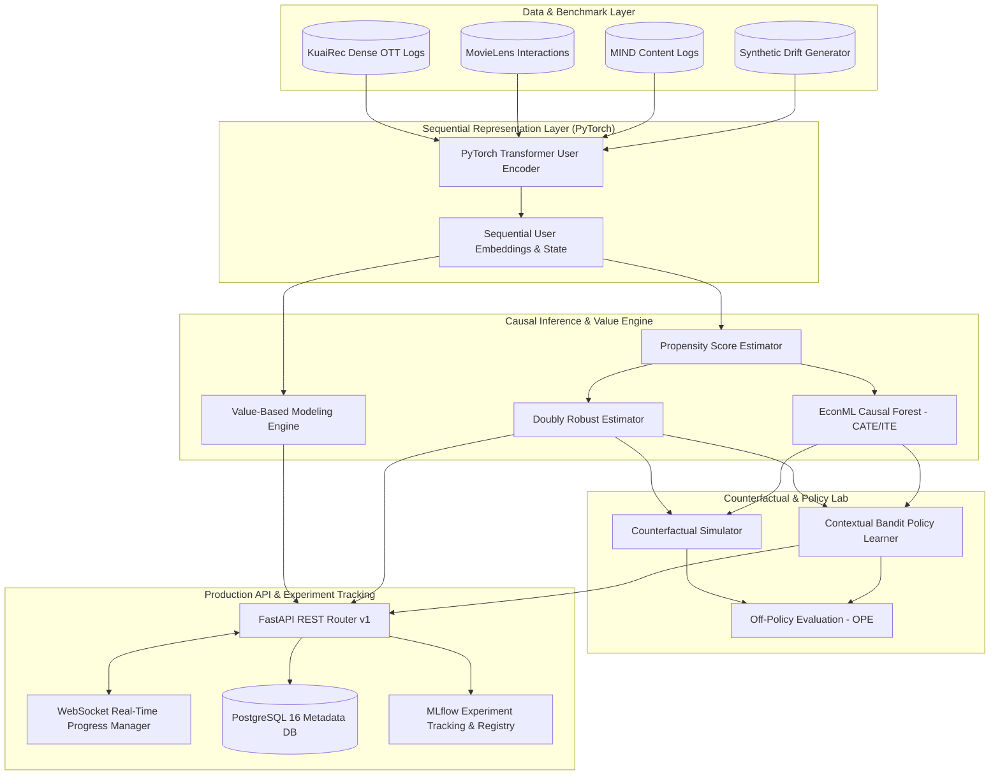

# Causal Personalization & User Behavior Modeling under Behavioral Drift
> **A Production-Grade Causal Machine Learning & Deep Representation Learning Framework for OTT User Retention, Value-Based Interventions, and Counterfactual Policy Optimization**

[](https://www.python.org/)
[](https://pytorch.org/)
[](https://econml.azurewebsites.net/)
[](https://fastapi.tiangolo.com/)
[](https://www.postgresql.org/)
[](https://mlflow.org/)
[](https://www.docker.com/)

---

## 📌 Executive Summary

This repository presents an end-to-end research and production platform engineered for **User Behavior Modeling and Causal Interventions on Over-The-Top (OTT) Streaming Platforms**.

Modern digital media platforms face continuous behavioral drift—shifts in user content preferences, engagement dynamics, and responsiveness to interventions over time. Standard machine learning models optimize for immediate proxy metrics (e.g., click-through rates) but fail to capture **true causal mechanisms** driving long-term user satisfaction, retention, and lifetime value.

This project bridges **Deep Representation Learning**, **Causal Inference (EconML / Doubly Robust Estimators / Causal Forests)**, and **Reinforcement Learning / Contextual Bandits** to:
1. **Model Multidimensional User Value**: Quantify perception of platform value across content relevance, session depth, and churn resistance.
2. **Estimate Heterogeneous Treatment Effects (CATE/ITE)**: Isolate the true causal impact of platform interventions (e.g., UI prompts, personalized push notifications, recommendation shifts) using IPW, Doubly Robust estimation, and Causal Random Forests.
3. **Simulate Counterfactual Interventions**: Evaluate alternative intervention policies offline using sequential PyTorch Transformer User Encoders without degrading live user experience.
4. **Track & Adapt to Behavioral Drift**: Detect covariate and concept drift in user behavior dynamics over temporal windows.

---

## 🎯 Core Research Capabilities & System Mapping

The platform implements a comprehensive suite of AI research and engineering components for user modeling and causal personalized decision-making:

| Research Capability | Architecture & Implementation Details |
| :--- | :--- |
| **OTT User Behavior Modeling** | Built modular dataset loaders for large-scale OTT micro-video & media benchmarks (**KuaiRec**, **MovieLens**, **MIND**), processing multi-modal interaction logs and session metrics. |
| **Value-Based User Modeling** | Implemented `value_service.py` to decompose and quantify user value across satisfaction, engagement depth, and retention probability. |
| **Causal Inference & Actionable Interventions** | Implemented `causal_service.py` featuring **Inverse Propensity Weighting (IPW)**, **Doubly Robust (DR) estimation**, and **EconML Causal Forests** for CATE/ITE estimation. |
| **Counterfactual Reasoning & Policy Evaluation** | Developed `counterfactual_service.py` and `policy_service.py` with **Contextual Bandits** and Off-Policy Evaluation (OPE) to evaluate intervention policies. |
| **Deep Learning & Transformers (PyTorch)** | Designed `transformer_encoder.py` (PyTorch) for learning deep sequential user state representations from high-dimensional interaction history. |
| **Behavioral Drift & Temporal Dynamics** | Built `drift_service.py` to monitor distribution shifts and policy performance under temporal behavioral drift. |
| **Scalable Production Engineering** | Production-ready **FastAPI** backend, **PostgreSQL 16** schema with Alembic migrations, **PyArrow/Parquet** analytics, **MLflow** experiment tracking, and **Docker Compose**. |

---

## 🏗️ System Architecture



---

## 💡 Key Research & Technical Features

### 1. Value-Based User Modeling (`app/services/value_service.py`)
- Formulates multi-component value metrics for OTT platform users:
  $$\text{Value}(u) = w_1 \cdot \text{Engagement}(u) + w_2 \cdot \text{Satisfaction}(u) - w_3 \cdot \text{ChurnRisk}(u)$$
- Quantifies user lifetime perception of value derived from content recommendations, UI interventions, and notification frequency.

### 2. Causal Engine & Heterogeneous Treatment Effects (`app/causal_engine/`)
- **Inverse Propensity Weighting (IPW)** (`ipw.py`): Corrects for selection bias in observational interaction logs.
- **Doubly Robust (DR) Estimation** (`doubly_robust.py`): Combines propensity score models with outcome regression to ensure unbiased treatment effect estimation even if one model is misspecified.
- **Causal Forest / EconML** (`causal_forest.py`): Non-parametric estimation of Conditional Average Treatment Effects (CATE) to discover *which user segments benefit most* from specific platform interventions.

### 3. Deep Sequential User State Encoder (`app/causal_engine/models/transformer_encoder.py`)
- Implemented in **PyTorch**, this Transformer architecture encodes user interaction sequences into dense state vectors.
- Captures time-varying user context, genre affinities, and session dynamics needed for counterfactual simulation.

### 4. Counterfactual Simulator & Policy Lab (`app/services/policy_service.py`)
- **Off-Policy Evaluation (OPE)**: Evaluates prospective intervention policies using logged historical data without risky A/B testing on live users.
- **Contextual Bandits** (`contextual_bandit.py`): Dynamically selects optimal interventions per user state to maximize long-term retention.

### 5. Behavioral Drift Monitoring (`app/services/drift_service.py`)
- Detects **Population Covariate Drift** ($P(X)$) and **Causal Concept Drift** ($P(Y|X, T)$) over temporal slices.
- Triggers model retraining when intervention efficacy degrades due to shifting user behaviors.

---

## 💻 Tech Stack & Tools

- **Core Language**: Python 3.11
- **Machine Learning & Deep Learning**: PyTorch 2.4, Scikit-Learn 1.5, NumPy, SciPy
- **Causal Inference**: EconML 0.15, Statsmodels, SHAP
- **Web Framework**: FastAPI 0.115, Uvicorn, WebSockets (Async IO)
- **Database & Storage**: PostgreSQL 16, SQLAlchemy 2.0, Alembic 1.13, PyArrow 17.0 (Parquet)
- **Experiment Tracking**: MLflow 2.16
- **Containerization & Ops**: Docker, Docker Compose

---

## 📂 Repository Structure

```
backend/
├── app/
│   ├── api/v1/                # REST endpoints & WebSockets
│   │   ├── causal.py          # /causal/estimate, /causal/cate, /causal/ite
│   │   ├── counterfactual.py  # /counterfactual/simulate
│   │   ├── drift.py           # /drift/population, /drift/causal
│   │   ├── experiments.py     # /experiments, WebSocket tracking
│   │   ├── policy.py          # /policy/train, /recommend, /evaluate
│   │   └── value.py           # /value/:user_id
│   ├── causal_engine/         # Core AI Research Algorithms
│   │   ├── estimators/        # IPW, Doubly Robust, Causal Forest (EconML)
│   │   ├── models/            # PyTorch Transformer User Encoder
│   │   └── policy/            # Contextual Bandit & OPE
│   ├── data/loaders/          # KuaiRec, MovieLens, MIND, Synthetic Loaders
│   ├── database/              # SQLAlchemy models, repositories, session
│   ├── services/              # Business & Orchestration logic
│   └── main.py                # FastAPI app entrypoint
├── scripts/                   # DB init & utility scripts
├── tests/                     # Unit & integration test suite
├── CONNECTIONS.md             # Detailed Frontend-Backend-DB contract map
├── Dockerfile                 # Container build definition
├── docker-compose.yml         # Multi-container orchestration (FastAPI + Postgres)
└── requirements.txt           # Dependency management
```

---

## 🚀 Quick Start Guide

### Prerequisites
- [Docker & Docker Compose](https://www.docker.com/) OR Python 3.11+ and PostgreSQL installed locally.

### Option 1: Quickstart with Docker Compose (Recommended)

1. Navigate to the backend directory:
   ```bash
   cd backend
   ```

2. Set up environment variables:
   ```bash
   cp .env.example .env
   ```

3. Launch the environment (PostgreSQL 16 + FastAPI server):
   ```bash
   docker compose up --build
   ```

4. Access interactive API documentation:
   - **Swagger UI**: [http://localhost:8000/docs](http://localhost:8000/docs)
   - **ReDoc**: [http://localhost:8000/redoc](http://localhost:8000/redoc)

---

### Option 2: Local Development Setup

1. Create and activate a Python virtual environment:
   ```bash
   cd backend
   python -m venv venv
   # Windows (PowerShell)
   .\venv\Scripts\Activate.ps1
   # Linux/macOS
   source venv/bin/activate
   ```

2. Install dependencies:
   ```bash
   pip install -r requirements.txt
   ```

3. Initialize PostgreSQL Database:
   ```bash
   python -m scripts.init_db
   ```

4. Start the FastAPI development server:
   ```bash
   uvicorn app.main:app --reload --host 0.0.0.0 --port 8000
   ```

---

## 🧪 Running Tests & Verification

Run the test suite using `pytest`:
```bash
pytest tests/ -v
```

---

## 📄 License & Summary

Developed as an end-to-end research and engineering platform for **Causal Inference, Deep User Representation Learning, and Behavioral Drift Adaptation in OTT Media Personalization**.
